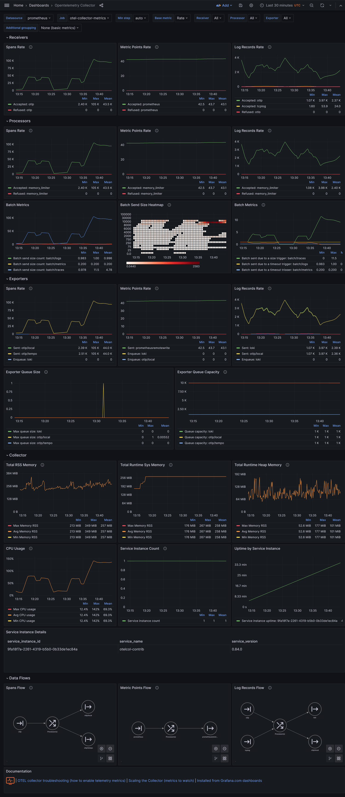

# Monitoramento do coletor OpenTelemetry (OTEL)

## Métricas

O coletor pode expor métricas do Prometheus localmente na porta 8888 e no caminho `/metrics`. Para ambientes containerizados, pode ser desejável expor essa porta em uma interface pública em vez de apenas localmente.

```yaml
service:
  telemetry:
    metrics:
      address: 127.0.0.1:8888
      level: detailed   
```

O coletor pode coletar suas próprias métricas por meio de sua própria linha de pipeline de métricas. Portanto, a configuração real pode parecer com isso:

```yaml
extensions:
  sigv4auth/aws:

receivers:
  prometheus:
    config:
      scrape_configs:
      - job_name: otel-collector-metrics
        scrape_interval: 10s
        static_configs:
          - targets: ['127.0.0.1:8888']

exporters:
  prometheusremotewrite/aws:
    endpoint: ${PROMETHEUS_ENDPOINT}
    auth:
      authenticator: sigv4auth/aws
    retry_on_failure:
      enabled: true
      initial_interval: 1s
      max_interval: 10s
      max_elapsed_time: 30s

service:
  pipelines:
    metrics:
      receivers: [prometheus]
      processors: []
      exporters: [awsprometheusremotewrite]
  telemetry:
    metrics:
      address: 127.0.0.1:8888
      level: detailed
```

## Painel do Grafana para métricas do coletor OpenTelemetry

[](https://github.com/monitoringartist/opentelemetry-collector-monitoring/tree/main/dashboard)

## Alertas do Prometheus

Alertas do Prometheus recomendadas para métricas do coletor OpenTelemetry:

```yaml
groups:
  - name: opentelemetry-collector
    rules:
      - alert: processor-dropped-spans
        expr: sum(rate(otelcol_processor_dropped_spans{}[1m])) > 0
        for: 5m
        labels:
          severity: critical
        annotations:
          summary: Algumas spans foram descartadas pelo processador
          description: Talvez o coletor tenha recebido spans não padrão ou tenha atingido alguns limites
      - alert: processor-dropped-metrics
        expr: sum(rate(otelcol_processor_dropped_metric_points{}[1m])) > 0
        for: 5m
        labels:
          severity: critical
        annotations:
          summary: Alguns pontos de métricas foram descartados pelo processador
          description: Talvez o coletor tenha recebido pontos de métricas não padrão ou tenha atingido alguns limites
      - alert: receiver-refused-spans
        expr: sum(rate(otelcol_receiver_refused_spans{}[1m])) > 0
        for: 5m
        labels:
          severity: critical
        annotations:
          summary: Algumas spans foram recusadas pelo receptor
          description: Talvez o coletor tenha recebido spans não padrão ou tenha atingido alguns limites
      - alert: receiver-refused-metrics
        expr: sum(rate(otelcol_receiver_refused_metric_points{}[1m])) > 0
        for: 5m
        labels:
          severity: critical
        annotations:
          summary: Alguns pontos de métricas foram recusados pelo receptor
          description: Talvez o coletor tenha recebido pontos de métricas não padrão ou tenha atingido alguns limites
      - alert: exporter-enqueued-spans
        expr: sum(rate(otelcol_exporter_enqueue_failed_spans{}[1m])) > 0
        for: 5m
        labels:
          severity: critical
        annotations:
          summary: Algumas spans foram enfileiradas pelo exportador
          description: Talvez o destino utilizado tenha um problema ou o payload utilizado não esteja correto
      - alert: exporter-enqueued-metrics
        expr: sum(rate(otelcol_exporter_enqueue_failed_metric_points{}[1m])) > 0
        for: 5m
        labels:
          severity: critical
        annotations:
          summary: Alguns pontos de métricas foram enfileirados pelo exportador
          description: Talvez o destino utilizado tenha um problema ou o payload utilizado não esteja correto
      - alert: exporter-failed-requests
        expr: sum(rate(otelcol_exporter_send_failed_requests{}[1m])) > 0
        for: 5m
        labels:
          severity: critical
        annotations:
          summary: Algumas solicitações de exportador falharam
          description: Talvez o destino utilizado tenha um problema ou o payload utilizado não esteja correto
      - alert: high-cpu-usage
        expr: max(rate(otelcol_process_cpu_seconds{}[1m])*100) > 90
        for: 5m
        labels:
          severity: critical
        annotations:
          summary: Alto uso máximo de CPU
          description: O coletor precisa aumentar a escala
```

## Conclusão

Durante este projeto, adquiri valiosos insights sobre o monitoramento do coletor OpenTelemetry utilizando métricas do Prometheus. Os aprendizados obtidos podem ser divididos em duas áreas principais:

### Aprendizados sobre Tecnologia

- **Configuração e Operação do Coletor OTEL:** Aprofundei-me na configuração e operação do coletor OpenTelemetry, aprendendo a expor métricas e a utilizar suas funcionalidades para coleta e processamento de telemetria.

- **Integração com o Prometheus e Grafana:** Compreendi a importância da integração entre o coletor OpenTelemetry, o Prometheus e o Grafana para monitoramento eficaz. Aprendi a configurar e utilizar essas ferramentas em conjunto para visualizar e analisar métricas de forma eficiente.

### Aprendizados Gerais

- **Importância do Monitoramento Proativo:** Reconheci a importância de adotar uma abordagem proativa para o monitoramento, identificando e resolvendo problemas antes que impactem os usuários finais.

- **Valor do Monitoramento de Telemetria:** Entendi o valor do monitoramento de telemetria para garantir a saúde e o desempenho dos sistemas, permitindo uma tomada de decisão embasada em dados.

- **Aplicabilidade do Conhecimento:** Visualizei como os conhecimentos adquiridos podem ser aplicados em projetos futuros, especialmente no contexto do projeto Inteli, onde o monitoramento eficaz é crucial para o sucesso do sistema. Inclusive, estou aplicando no meu estágio.

Este projeto não apenas expandiu meu conhecimento técnico em monitoramento, mas também fortaleceu minha compreensão sobre a importância do monitoramento proativo e contínuo na manutenção de sistemas robustos e confiáveis.
## Documentação

- https://github.com/open-telemetry/opentelemetry-collector/blob/main/docs/monitoring.md
- https://github.com/open-telemetry/opentelemetry-collector/blob/main/docs/troubleshooting.md#metrics